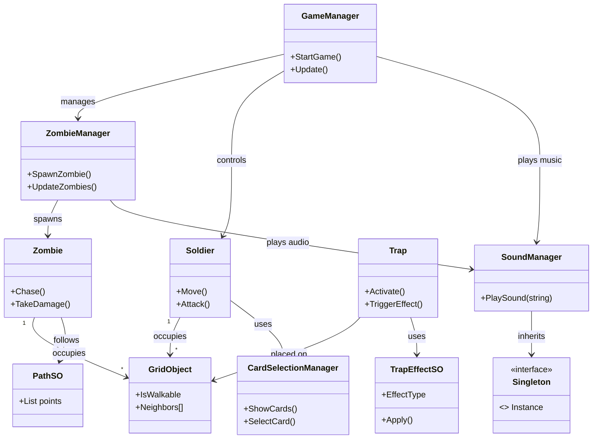

# Zombified

<p align="center">
  
</p>

**Zombified** is a top‑down, grid‑based zombie‑survival game built with Unity.  Players control a soldier, navigate a procedurally generated grid, and battle waves of zombies while using traps and special abilities.

---

## Table of Contents
- [Features](#features)
- [Installation & Running](#installation--running)
- [Gameplay Controls](#gameplay-controls)
- [Project Structure](#project-structure)
- [Key Scripts & Architecture](#key-scripts--architecture)
- [UML Diagram](#uml-diagram)
- [Contributing](#contributing)
- [License](#license)

---

## Features
- Grid‑based movement with path‑finding.
- Dynamic zombie AI with multiple behaviours.
- Soldier abilities & upgrade cards (CardSelectionManager).
- Variety of traps and trap effects (ScriptableObjects).
- Particle effects and sound management.
- Custom input actions using Unity Input System.
- Modular architecture – managers, entities, scriptable objects.

---

## Installation & Running
1. **Prerequisites**
   - Unity Hub (recommended version 2021.3 LTS or later).
   - Unity packages: `Input System`, `TextMeshPro` (listed in `Packages/manifest.json`).
2. **Clone the repository**
   ```bash
   git clone https://github.com/mazensameh770-dev/Zombified.git
   cd Zombified
   ```
3. **Open the project**
   - Launch Unity Hub → *Add* → select the project folder `Zombified`.
   - Unity will import assets; this may take a minute.
4. **Play the game**
   - Open the starting scene `Assets/Scenes/Main.unity` (or the scene indicated in `ProjectSettings/EditorBuildSettings.asset`).
   - Press **Play** in the Unity editor.
5. **Build (optional)**
   - `File → Build Settings…` → add the desired scenes → choose platform → *Build*.

---

## Gameplay Controls
| Action | Keyboard / Mouse |
|--------|-------------------|
| Move   | `W A S D` or Arrow keys |
| Aim / Look   | Mouse movement |
| Shoot / Attack | Left Mouse Button |
| Use Ability / Card | `Space` |
| Place Trap | `E` |
| Pause | `Esc` |

---

## Project Structure
```
Zombified/
├─ Assets/
│   ├─ Animations/          # Animator controllers & animation clips
│   ├─ Art/                  # 3D models, textures
│   ├─ Materials/            # Material assets
│   ├─ Particles/            # Particle system prefabs
│   ├─ Prefabs/              # Ready‑to‑instantiate game objects
│   ├─ Scenes/               # Unity scenes (Main.unity, etc.)
│   ├─ ScriptableObjects/    # Data‑only objects (PathSO, TrapEffectSO, …)
│   ├─ Scripts/              # C# source files
│   │   ├─ Core/              # Core utilities (Singleton, etc.)
│   │   ├─ Managers/          # GameManager, ZombieManager, SoundManager, …
│   │   ├─ Entities/          # Soldier, Zombie, Trap, GridObject
│   │   ├─ UI/                # UI managers & panels
│   │   └─ Interfaces/        # Interface definitions
│   └─ UI/                    # UI prefabs & canvases
├─ Packages/                  # Unity package manifest
├─ ProjectSettings/           # Editor & player settings
└─ README.md                 # **This file**
```

---

## Key Scripts & Architecture
| Folder | Important Scripts | Responsibility |
|--------|------------------|----------------|
| **Core** | `Singleton.cs` | Generic singleton base class used by most managers. |
| **Managers** | `GameManager.cs` – overall game flow, state machine.<br>`ZombieManager.cs` – spawning and tracking zombies.<br>`SoundManager.cs` – centralized audio playback. |
| **Entities** | `Soldier.cs` – player character logic, movement, attacks.<br>`Zombie.cs` – enemy AI, path‑finding, health.<br>`Trap.cs` – trap placement & activation.<br>`GridObject.cs` – representation of a cell in the grid. |
| **ScriptableObjects** | `PathSO.cs` – reusable path data.<br>`TrapEffectSO.cs` – defines trap behaviour (damage, slow, etc.). |
| **UI** | `CardSelectionManager.cs` – handles ability‑card selection UI. |
| **Grid** | `GridNeighborsSetup.cs` – builds neighbour relationships for path‑finding. |

The architecture follows a **manager‑entity** pattern: each *Manager* owns a collection of related *Entities* and updates them each frame.  Data‑driven behaviour is achieved through ScriptableObjects, allowing designers to tweak values without code changes.

---

## UML Diagram


---

## Contributing
Contributions are welcome! Please fork the repository, create a feature branch, and submit a pull request. Follow the existing coding style and test changes in the Unity editor.

---

## License
This project is provided **without a license** – feel free to use it for personal learning or as a foundation for your own projects.
